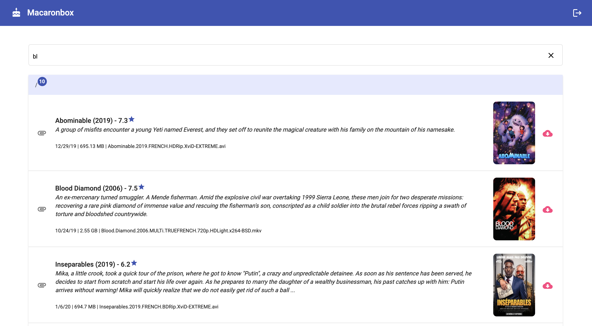
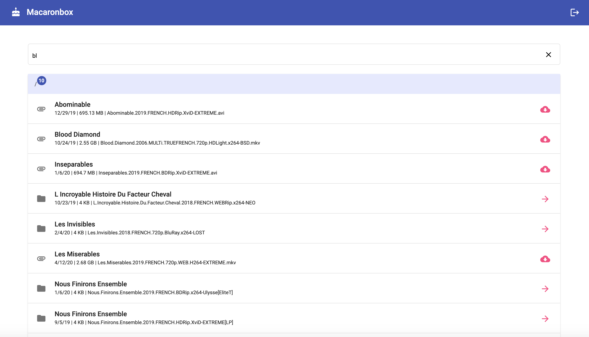
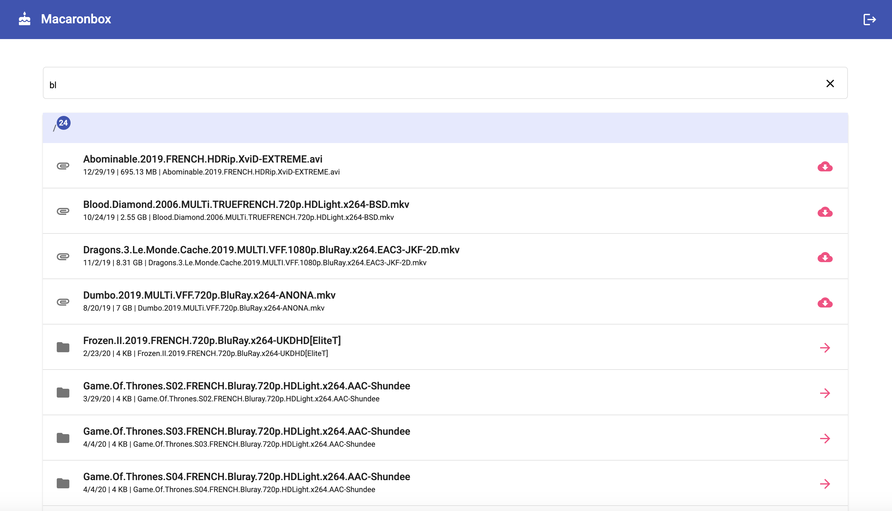

# Macaronbox
A small web interface inspired by Cakebox-light written with Angular and NodeJS, to allows you to browse, manage and share the files you want.
You can use it with [rtorrent](https://github.com/rakshasa/rtorrent) and [Flood UI](https://github.com/Flood-UI/flood) to easily share your downloads.

## Screenshots
With ParseTorrentName and TmdbApi :


With only ParseTorrentName :


Without ParseTorrentName :


## Getting started
### Pre-Requisites
1. NodeJS v10 or higher
2. node-gyp, see https://www.npmjs.com/package/node-gyp#installation
3. (OPTIONAL) themoviedb.org api key : create an account, go to https://www.themoviedb.org/settings/api and ask/get API Key (v3 auth).

### Installation
1. git clone https://github.com/DownloadHelper/macaronbox.git
2. cd macaronbox
3. cd macaronbox-client && npm install
4. npm run build:prod
5. cd ../server && npm install

### Configuration
1. In ./server copy `config.template.js` to `config.js` and review its comments. **This is required.**

### Run
From the root of the server directory...
1. `npm start`

With default settings, go to http://localhost:8081. You can configure the port in config.js.

Of course this is recommended to :
1. Create a technical user `macaronbox` (with no ssh and no home, for example : `useradd -r -s /sbin/nologin macaronbox`)
2. Change owner of macaron app (for example : `chown -R macaronbox:macaronbox ./macaronbox`)
3. Create, enable and use service in `/etc/systemd/system`
Service example `/etc/systemd/system/macaronbox.service` : 
```
[Service]
WorkingDirectory=/opt/macaronbox/server
ExecStart=/usr/bin/npm start
Restart=always
StandardOutput=syslog
StandardError=syslog
SyslogIdentifier=notell
User=macaronbox
Group=macaronbox
Environment=NODE_ENV=production
[Install]
WantedBy=multi-user.target
```