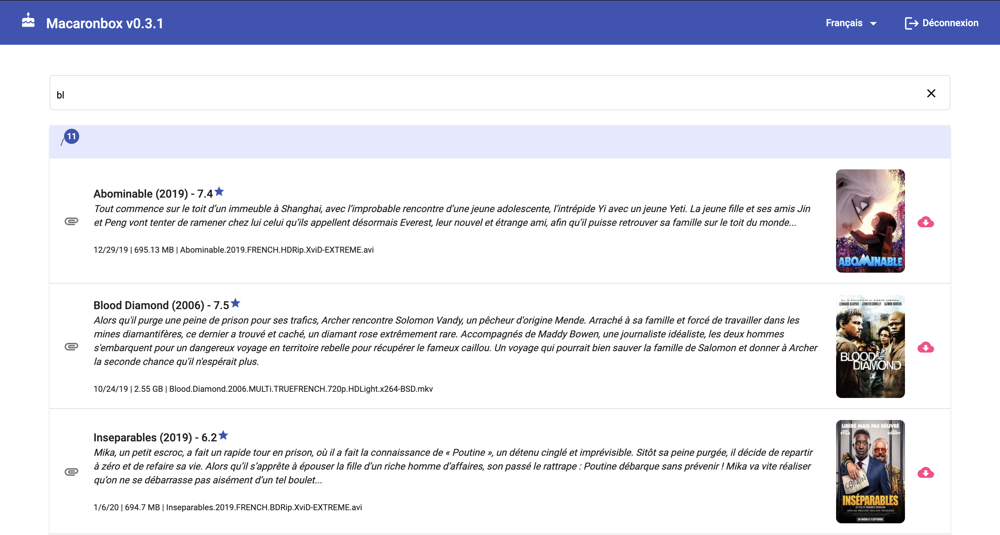

# Macaronbox
A small web interface inspired by [cakebox-light](https://github.com/cakebox/cakebox) written with Angular and NodeJS, to allows you to browse, manage and share the files you want.

You can use it with [rtorrent](https://github.com/rakshasa/rtorrent) and [Flood UI](https://github.com/Flood-UI/flood) to easily share your downloads.

## Screenshots
### With Parse Torrent Name and Tmdb Api (in config)


### When streaming is possible (.mp4 file)


## Next features
* [X] Internationalization (i18n)
* [X] Check new version
* [X] Stream when it's possible (mp4 only for now)
* [] Download all folder (as zip or tar)
* [] Manage users (add/delete/edit user)
* [] Pagination
* [] Caching
* [] Real release process
...

## Getting started
### Pre-Requisites
1. NodeJS v10 or higher
2. node-gyp, see https://www.npmjs.com/package/node-gyp#installation
3. (OPTIONAL) themoviedb.org api key : create an account, go to https://www.themoviedb.org/settings/api and ask/get API Key (v3 auth).

### Installation
1. `git clone https://github.com/DownloadHelper/macaronbox.git`
2. `cd macaronbox`
3. `cd macaronbox-client && npm install`
4. `npm run build:prod`
5. `cd ../server && npm install`

### Configuration
1. In ./server copy `config.template.js` to `config.js` and review its comments. **This is required.**

### Run
From the root of the server directory...
1. `npm start`

With default settings, go to http://localhost:8081. You can configure the port in config.js.

Of course this is recommended to :
1. Create a technical user `macaronbox` (with no ssh and no home, for example : `useradd -r -s /sbin/nologin macaronbox`)
2. Change owner of macaron app (for example : `chown -R macaronbox:macaronbox ./macaronbox`)
3. Create, enable and use service in `/etc/systemd/system`

Service example `/etc/systemd/system/macaronbox.service` : 
```
[Service]
WorkingDirectory=/opt/macaronbox/server
ExecStart=/usr/bin/npm start
Restart=always
StandardOutput=syslog
StandardError=syslog
SyslogIdentifier=notell
User=macaronbox
Group=macaronbox
Environment=NODE_ENV=production
[Install]
WantedBy=multi-user.target
```

### Login
For your first login you have to use default **admin** user. Username : admin / Password : admin.

### Updating
1. `git pull`
2. check potential change into `config.template.js`
3. kill the currently running macaronbox server
4. rerun `npm install` into macaronbox-client and server
5. rerun `npm run build:prod` into macaronbox-client
6. restart server with `npm start`

## Local Development
1. Run `npm install` on **macaronbox-client** and **server**
2. Run `npm start` on **macaronbox-client**
3. Uncomment cors config on **server/server.js**
```
// ONLY FOR DEV
// app.use(function (req, res, next) {
//   res.setHeader('Access-Control-Allow-Origin', 'http://localhost:4200');
//   res.setHeader('Access-Control-Allow-Methods', 'POST,DELETE');
//   res.setHeader('Access-Control-Allow-Headers', 'X-Requested-With,content-type');
//   res.setHeader('Access-Control-Allow-Credentials', true);
//   next();
// });
```

4. Run `npm start` or `nodemon server.js` on **server**
5. Access to the front UI on your browser. Default is `http://localhost:4200`.